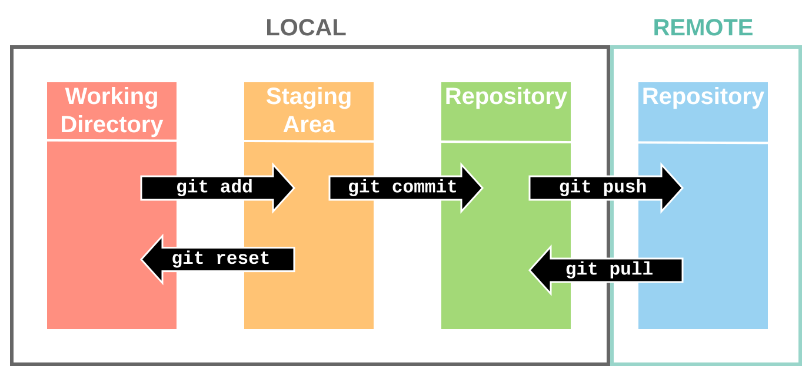

## Git란?

Git은 2005년 리누스 토르발스가 개발한 **분산 버전 관리 시스템(DVCS, Distributed Version Control System)**으로, 소스코드의 스냅샷을 기록하여, 변경이력관리와 특정 시점으로 복귀하거나 다수의 개발자가 동시에 분산된 환경에서 브랜칭을 통해 코드를 개발하고, 병합 절차를 통해 충돌을 해결할 수 있는 기능이 있습니다.
이러한 분산형 구조와 성능 최적화 덕분에, Git은 전 세계적으로 대다수 개발팀에서 사용되는 표준 버전 관리 도구로 자리잡았습니다.

## Git 유용성

코딩초보에게는 Git 사용법이 다소 어려울 수 있지만, 코드를 수정하다가 문제가 발생했을 때, 변경이력관리 기능을 이용해 특정시점으로 되돌릴 수 있으며 이 자체가 백업 기능도 되므로 유용하기에 연구회에서는 Git 사용을 추천합니다.

## Git개념과 용어

Git 초기 설정에 앞서 Git에서 사용되는 개념과 용어를 이해하는 것이 좋습니다.
Git 공식사이트의 한글매뉴얼(<https://git-scm.com/book/ko/v2/%ec%8b%9c%ec%9e%91%ed%95%98%ea%b8%b0-Git-%ea%b8%b0%ec%b4%88>)을 학습하시길 추천합니다.
### untracked/staged/committed Git에서는 프로젝트폴더 내의 모든 파일을 추적(=관리)대상파일과 추적대상이 아닌 파일로 구분합니다.
추적대상파일은 인 파일로 @fig-GitConcept.

{#fig-GitConcept}